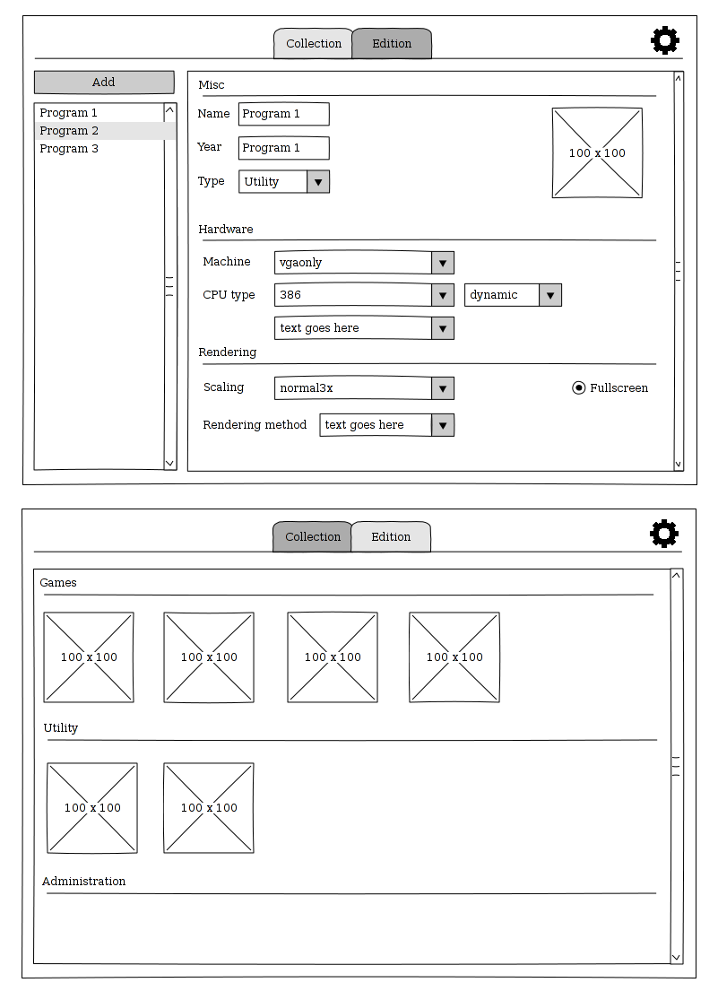

% Spécifications fonctionnelles - DOSMAN
% Duane Bekaert - Mamadou Coulibali
% 2013-12-18

DOSMAN
======

DOSMAN est un front-end graphique [DosBox](http://www.dosbox.com/) graphique écrit en C++ utilisant [gtkmm 3.0](http://www.gtkmm.org/en/) et ayant pour but d'être utilisé dans des environnements de bureau GNU/.Linux modernes.  

DosBox
------

DosBox est un émulateur permettant de simuler un environnement MS-DOS et PC-DOS ainsi que le matériel sur lequel ces systèmes fonctionnent. Afin d'obtenir les meilleures performances possibles pour un programme donné, il est souvent nécessaire de spécifier les particularités matérielles du système à émuler, cela comprend la vitesse et le type de processeur, la ram, les différentes cartes son et vidéo, les périphériques à émuler ou ceux à relier à la machine physique (imprimantes, ports série, lecteurs disquette ou CD...) . Ces configurations peuvent être faites dans un fichier "pain text" passé en argument lors de l'invocation de DosBox.

    dosbox -conf configuration.conf

Quand aucun fichier n'est spécifié, c'est la "configuration utilisateur" qui est utilisé. Cette configuration est décrite dans le fichier '~/.dosbox/dosbox-<version>.conf'. Ce fichier est copié depuis un répertoire d'installation lors de la première utilisation de DosBox.  

Mode de fonctionnement proposé
------------------------------

DOSMAN devra gérer l'installation, la configuration, l'exécution, la gestion de snapshots, captures d'images et de vidéo de logiciels DOS émulés avec DosBox. Pour ce faire in convient de définir son fonctionnement attendu.  

Chaque logiciel géré par DOSMAN se vera attribué son propre dossier dans le répertoire utilisateur de DOSMAN. Ce répertoire utilisateur sera un répertoire caché propre à DOSMAN désigné à contenir les logiciels gérés dans leurs dossiers respectifs, ainsi que les fichiers de configuration leur étant propre. Le nom proposé pour le répertoire utilisateur de DOSMAN sera *~/.dosman/* .   

Contenu des répertoires de programmes:   
- Fichier de configuration (dosbox.conf)   
- Fichier image servant d'icône dans DOSMAN (cover.jpg, cover.png) [optionnel]   
- Sous répertoire contenant les fichiers d'installation du programme  

Plus d'informations sur les fichiers de configuration de dosbox peuvent être trouvés [ici](http://www.dosbox.com/wiki/Dosbox.conf). Ces propriétés sont celles qui devront être éditables dans l'interface de DOSMAN pour chaque programme.  

Bibliothèques logiciel utilisées
--------------------------------

Afin de réaliser l'interface graphiue, c'est la bibliothèque [gtkmm 3.0](http://www.gtkmm.org/en/) développée par le projet [GNOME](http://www.gnome.org/) qui sera utilisée. La lécture et écriture des fichiers de configuration sera effectuée grace à la librairie glibmm, binding C++ de la librairie Glib.

Interface utilisateur proposée
------------------------------

L'interface utilisateur proposée se divise en plusieurs écrans aussi appelés vues.

- Vue liste/configuration:
Cette vue est divisée en 3 sections:  
    - Barre de tache supérieure permettant l'ajout et la suppression d'entrées de programmes ainsi que l'accès à une fenêtre de configuration de DOSMAN.
    - Liste des entrées de programmes.
    - Panneau de configuration permettant la modifications d'éléments du fichier de configuration ainsi que d'ouvrir ce dernier dans un éditeur de texte pour édiion avancée. Le contenu de ce panneau dépends de l'entrée sélectionnée dans la liste des programmes.

- Vue "Collection"
Cette vue regroupe de façon graphique les différents programmes installés dans DOSMAN en utilisant les images spécifiées dans leur dossiers d'installation. Des icônes par défaut seront utilisés pour les programmes n'ayant pas d'images associées. Cette vue sera proposée par défaut à partir du moment ou au moins un programme sera installé via DOSMAN.   

- Vue configuration:
Cette vue permet de configurer DOSMAN, modifier son dossier utilisateur ou rétablir celui par défaut, sélectionner la page que l'application montrera à son lancement par défaut et d'éditer de fichier de configuration de dosbox global.  

Maquettes
---------

GANT
----

